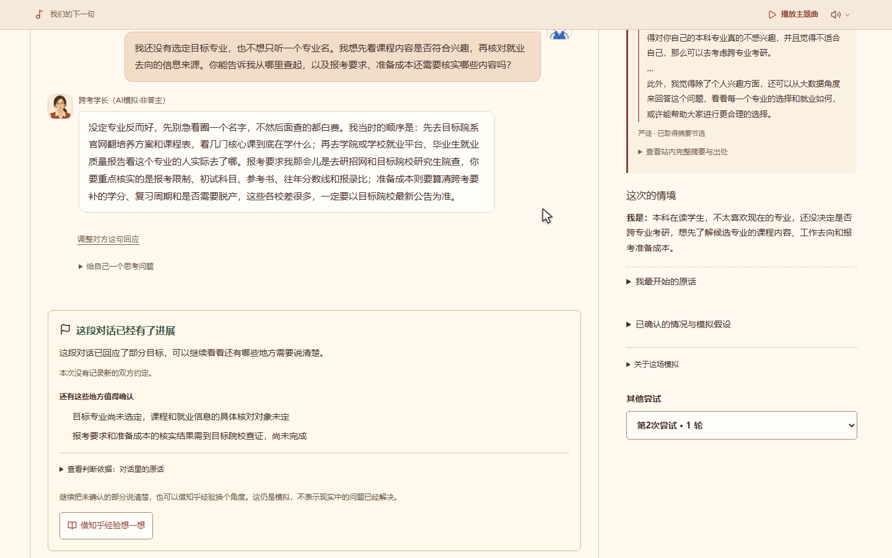

# 答案之外｜经验练习场

**在重要的第一次之前，先练一次。**

面向大学生的互动练习产品。把知乎里的问题与经验线索带进自己的处境，先练一次请教、沟通或协商，再回看尝试、调整说法，留下现实中的下一步。

[在线体验](https://practice.wredamancy.com/) · [按情况选题](https://practice.wredamancy.com/discover) · [怎样练一次](https://practice.wredamancy.com/how-it-works)



*线上真实操作截帧：演示者重试另一种问法，页面保留尚待核实的事项。角色为 AI 模拟。*

本仓库整理自正式版 **1.0.5**，包含完整应用源码、测试、数据库迁移、锁文件及运行素材。参赛材料见 [九页计划书 PDF](docs/project/答案之外-项目计划书-参赛版.pdf) 和 [图文正文](docs/project/答案之外-项目计划书-提交正文.md)。计划书中的模拟对话为明确标注的演示，不是真实同学的私人对话记录。

## 1.0.5 更新

- 让导师、科研与复试相关选题的练习起点保持对应的角色和主题；修复旧自动草稿与迟到生成结果的来源关联，保留用户自行改写的内容。
- 主题曲改为可拖动的音符小球，顶部不占位。点击展开暂停／继续与音量设置，记住位置和音量。进入页面尝试播放，浏览器拦截时在首次页面交互后重试；显式暂停与后台暂停后需要手动继续。
- 以上改动已同步正式站，保留来源版本、独立分支和原练习记录。自动播放仍受浏览器规则限制，不能保证所有设备首次打开即有声音。

## 可以怎样练

- 选一个知乎问题，或写下自己的事；修改角色、前情和目标，确认后开始交流。
- 自己输入，或把建议先放进草稿再编辑；可以返回上一步，也可以设想另一种回应，保留原分支继续尝试。
- 回查回答片段、作者与原文入口，保存经验记录，导出文字／JSON 或通过浏览器打印 PDF。
- 体验校园协作《最后一晚》、半小时小任务和《入职第一周》三个固定章节。范围、分工、时间与接受状态由规则检查，不把排期可行写成现实任务已完成。

## 本地运行

需要 **Node.js 24** 和 **pnpm 11.19.0**。使用当前锁文件安装，不需要 Codex、知乎 CLI、Docker 或本机 PostgreSQL 即可浏览页面和操作固定篇的明确任务选项。

```sh
git clone https://github.com/jsdhwfmax/beyond-answers-practice.git
cd beyond-answers-practice
pnpm install --frozen-lockfile
pnpm dev
```

打开 <http://127.0.0.1:3000>。开发记录保存在本机 `.local/`，不会自动上传到正式站。未配置模型时，自由练习和自然语言解释明确显示不可用。

需要模型或数据库时，将 [.env.example](.env.example) 复制为 `.env.local`，在自己电脑上填写配置。不要把真实值提交到仓库。

| 配置 | 用途 |
| --- | --- |
| `MODEL_PROVIDER=bailian`、`DASHSCOPE_API_KEY`、`BAILIAN_MODEL` | 固定章节使用百炼千问，将原话解释为候选动作；当前正式模型为 `qwen3.8-max-0902` |
| `CUSTOM_MODEL_PROVIDER=deepseek`、`DEEPSEEK_API_KEY`、`DEEPSEEK_MODEL` | 自由练习使用 DeepSeek Flash，整理设定、模拟回应；正式模型为 `deepseek-flash` |
| `DATABASE_URL`、`DATABASE_URL_MIGRATION` | 分别为应用连接与迁移连接。开发时可省略并使用文件记录；生产必须使用 PostgreSQL |
| `PUBLIC_APP_ORIGIN` | 自己部署的网站 HTTPS 地址 |
| `TEST_DATABASE_URL` | 可选的独立测试数据库；不要使用生产数据库 |
| `ZHIHU_ACCESS_SECRET` | 可选的官方公开话题接口配置；内置版本化题库不需要此项 |

模型名称与权限以自己的供应商账号实际支持范围为准。模板中的模型地址不包含任何凭据。`CUSTOM_MODEL_PROVIDER` 留空时继承主供应商，可按需配置其他已实现的适配。

```sh
pnpm check:config
# 配好独立 PostgreSQL 后再执行：
pnpm db:migrate
pnpm build
pnpm start
```

`check:config` 只检查配置是否存在，不代替模型或数据库连通性测试。生产应将本地应用端口放在 HTTPS 反向代理后。仓库中的 `vercel.json` 是保留的可选托管配置；正式作品运行于腾讯云香港。

## 实现与验证

Next.js、React 和 TypeScript 负责网页与服务端接口。自由练习使用 DeepSeek 模拟交流，再检查角色归属、引用和关键事实；固定章节使用百炼解释动作，再由任务、时间、依赖和成员接受规则更新项目板。PostgreSQL 保存来源快照、事件和独立分支，动作编号、版本与归属校验保护记录。用户自己调整的对方台词会标记为模拟假设，不认证为对方独立接受；现实反思只保存在当前浏览器。

```sh
pnpm exec next typegen
pnpm typecheck
pnpm lint
pnpm test
pnpm build
# 先保持 pnpm dev 运行，再在另一终端执行：
pnpm exec playwright install chromium
pnpm test:e2e
```

单元测试使用合成数据；浏览器中的部分模型接口明确使用模拟响应。真实 API 评估需自行配置密钥，并会产生供应商调用费用，不能用模拟测试结果代替：

```sh
pnpm eval:models --split=development --repeats=1
```

[验证范围](docs/VERIFICATION.md) 分开说明既有工程检查、真实模型验证和此次源码整理。未附私人反馈、游客记录、密钥、数据库备份或内部部署日志。

## 来源与素材

运行题库保留正式页面所需的 325 道公开问题及回答片段，其中 130 道有背景证据；未缩减离线题库。标签只描述材料提到的背景，不认证作者身份。10 道题另有绑定原片段的团队提炼；其他题直接展示已取得摘要。原片段不等于全文，AI 角色不代表答主本人。

源码仓库：[jsdhwfmax/beyond-answers-practice](https://github.com/jsdhwfmax/beyond-answers-practice)。

知乎内容、项目制作的插画、用户提供的主题曲和应用代码具有不同来源。本仓库没有给第三方回答、音乐或依赖授予统一开源许可；引用范围与素材说明见 [来源与素材说明](THIRD_PARTY_NOTICES.md)。
