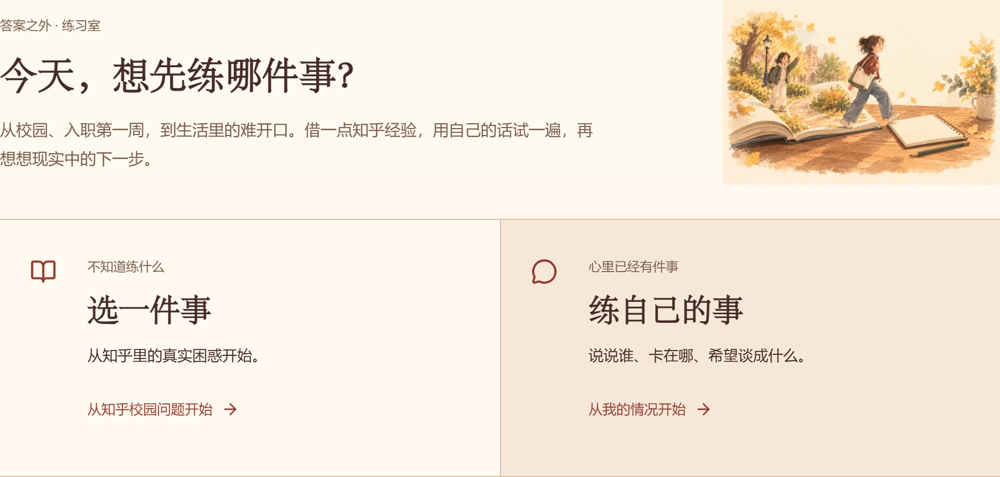
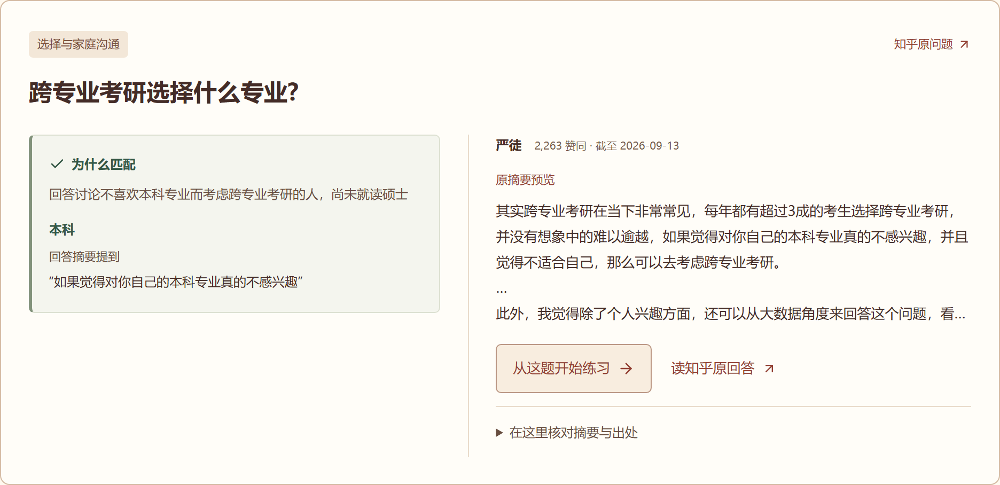
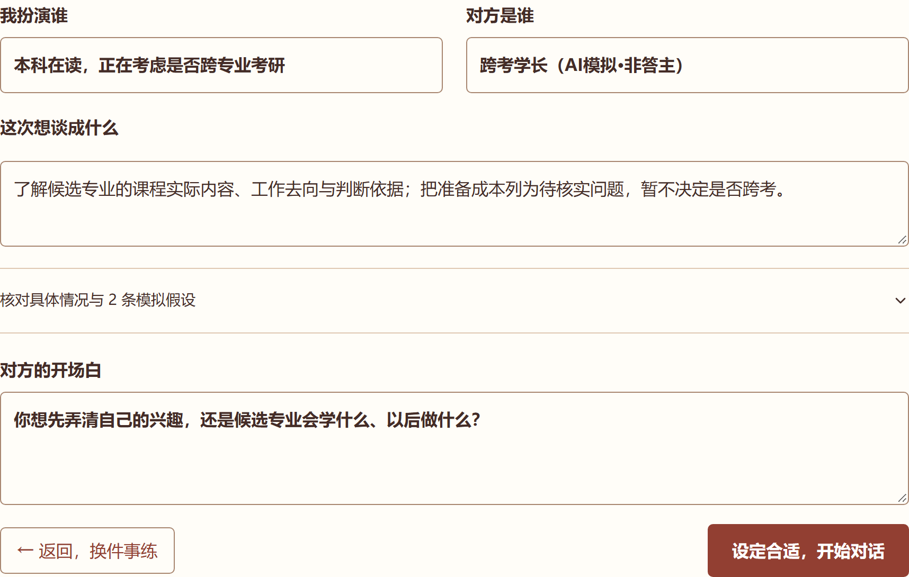
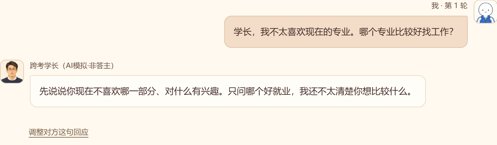
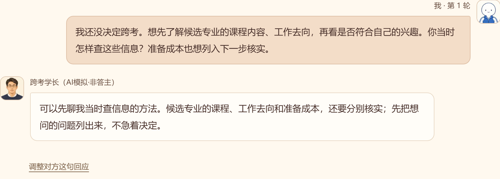
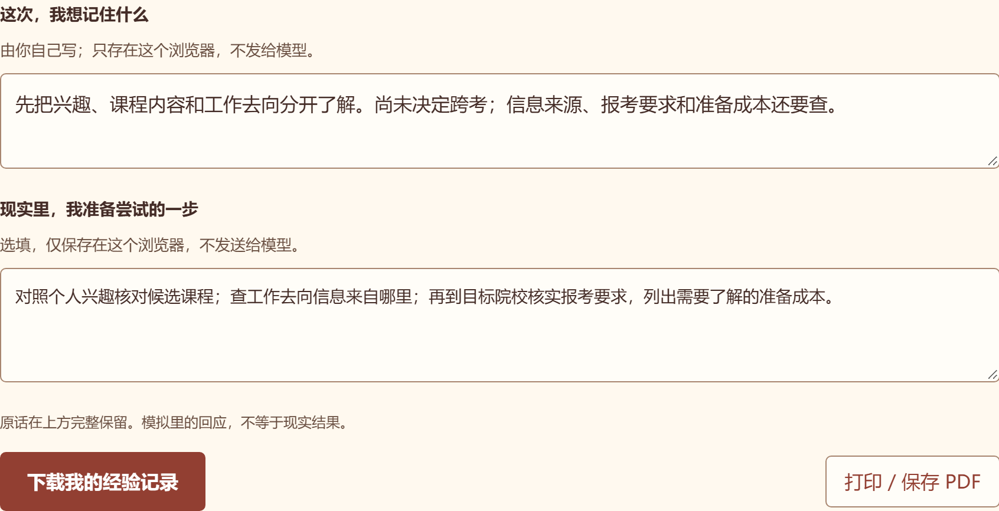
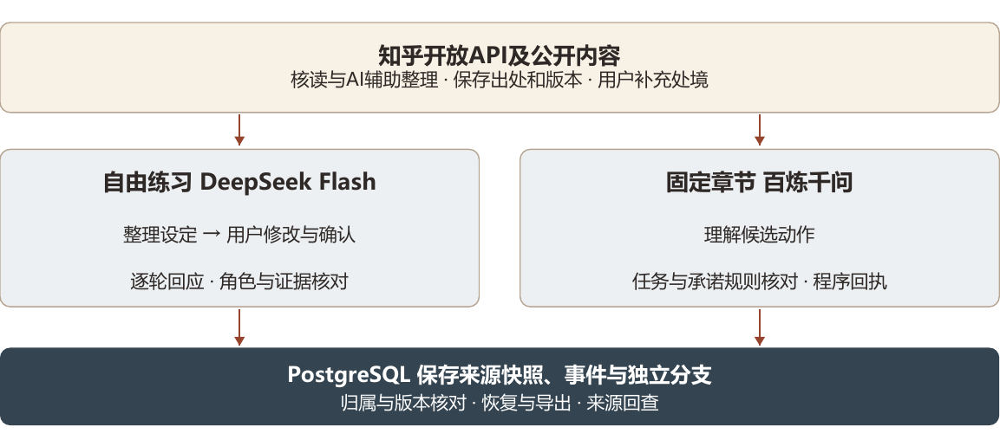
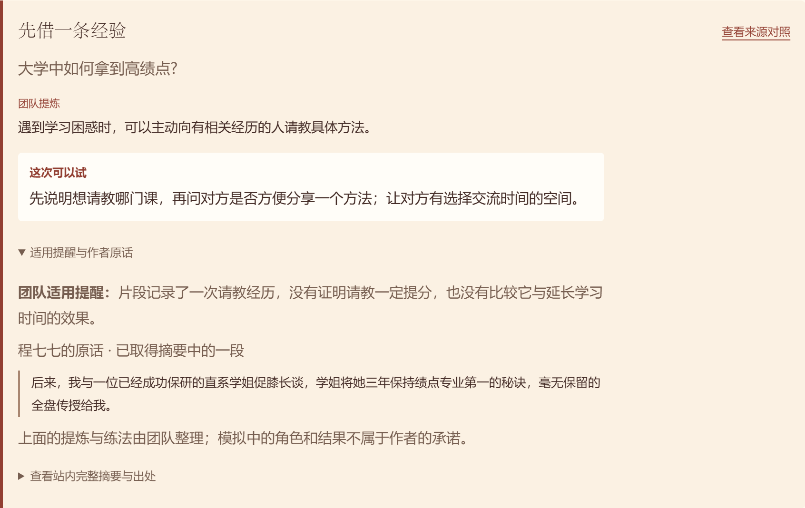

# 答案之外 经验练习场

知乎黑客松2026校园新锐季 项目计划书

在重要的第一次之前，先练一次。

第一次考虑读研，第一次带领小组，第一次准备实习，我们会去知乎寻找走过这段路的人。读过他们的经历之后，仍要回答一个属于自己的问题：换成我的处境，接下来该问什么、怎样开口？

答案之外是一款面向大学生的互动练习产品。我们把知乎问题与经验线索带进可修改的校园情境，让学生先试着交流、追问和重来，再带着更具体的问题与下一步，回到原回答或现实中的谈话。

团队：答案之外　参赛方向：知识炼金场＋跨次元游乐场

阅读路线：校园起点 02　知乎价值 03　同题练习 04-06
技术实现 07　校园反馈 08　后续计划 09

[作品地址](https://practice.wredamancy.com/)

## 01 校园需求与创作思路

### 有些第一次，连问题都还没想清

我们的创作起点，是读过经验之后，仍不知道怎样开始的那一刻。

#### 从校园中具体的一件事开始

考虑跨专业考研，拿不准自己是不喜欢几门课，还是不适合这个方向；第一次负责小组，想提醒进度，又担心让同学难堪；准备找实习，希望请教前辈，却只能问出“我该怎么办”。我们选择这些需要了解情况、表达顾虑和协商安排的校园时刻作为入口。

#### 把经验放回自己的关系与条件

读回答时觉得有道理，轮到自己，人物、关系和限制都变了。我们想给学生一次提前尝试的机会：先说一个不够完整的版本，听见一种可能的回应，再发现漏问了什么。练习的目标是让人准备好更具体的问题和行动，人生选择仍由本人作出。

## 02 知乎生态与场景价值

### 为什么从知乎的经验出发

回答里的经历与条件，给练习提供了可以追问的线索。

[本例原回答：严徒回答《跨专业考研选择什么专业？》](https://www.zhihu.com/question/279426192/answer/868397645?utm_medium=openapi_platform&utm_source=cf621feb3f2d)

#### 一条回答，怎样成为练习的起点

已收录的问题“跨专业考研选择什么专业？”下，严徒的回答片段提到个人兴趣，也建议参考各专业的选择与就业情况。我们从中提取两个需要继续了解的角度：这个方向是否适合自己，关于工作去向的判断又有什么依据。接下来的请教情境与问法，是团队据此设计的原创模拟。

#### 经验被尝试，出处也留在身边

学生可以按材料中明确的学历与阶段线索找到相关问题，保留作者、回答片段和原文入口。练习中发现的新疑问，又可以带回知乎继续阅读。我们希望给社区经验增加一种使用方式：带着自己的条件去理解和尝试，同时让作者的表达仍然可见、可回查。

## 03 从经验到练习

### 从选专业的疑问，到一次具体请教

同一条经验进入练习时，用户可以把角色、顾虑和目标改成自己的情况。

#### 先把“好专业”问得具体一点

沿着上一页的问题，这次演示设定为：一名本科生尚未决定是否跨考，想向有相关经历的学长了解候选专业。知乎片段里的“兴趣与就业”成为请教的线索；课程实际内容、怎样查工作去向和准备成本，则被写成这次还需要核实的问题。

#### 模拟假设要由用户确认

用户可以修改角色、前情、目标和开场白，再开始交流。学长是AI模拟的沟通对象，不代表严徒本人。没有匹配来源的自述会明确按原创情境练习；有来源时保留实际取得的片段，不把片段当作全文，也不把模拟假设归给原作者。

## 04 表达与重试

### 换一种问法，看看还漏了什么

开口与重试，让读到的经验变成自己可以尝试的表达。

#### 把一个宽泛问题继续往下问

第一次只问就业，另一种尝试把兴趣、课程和信息依据说得更具体。同一条知乎经验，由此变成用户自己可以继续追问的问题。

#### 允许改口，也保留原来的尝试

重试保留原记录，新尝试另存；用户也能调整对方的最新回应，或修改建议草稿。允许改口，是为了试探不同反应，找到愿意在现实里说出口的话。

## 05 练习之后的下一步

### 把练过的经验，带回自己的生活

练习留下的是看清的条件、尚未确定的事，以及准备尝试的一步。

#### 这次请教，没有替学生决定跨考

演示中的学生仍未选定专业，但已把“好不好”拆成可以继续查证的问题：课程内容是否符合兴趣，工作去向的信息从哪里来，报考要求与准备成本还缺哪些了解。记录保留原话，用户自己写下有用的提醒和现实下一步，再回到原回答或找真实的前辈请教。

#### 给校园经验一个继续被使用的机会

从别人的经历出发，经过自己的提问，再带着疑问回到社区，这是我们想形成的使用过程。用户能保存、导出或删除练习记录；现实反思只留在当前浏览器，默认不发送给模型。是否真的帮助了后续交流，需要在真实使用中继续观察。

## 06 整体技术实现

### 自然表达背后，有清楚的实现分工

知乎内容提供依据，AI接住表达，程序检查事实并保存每一次尝试。

知乎开放API及公开内容，经核读与AI辅助整理，保存出处和版本，并结合用户补充的处境。自由练习由DeepSeek Flash整理设定，用户修改确认后逐轮交流，服务端核对角色和证据。固定章节由百炼千问理解候选动作，程序核对任务与承诺并给出事实回执。PostgreSQL保存来源快照、事件与独立分支，支持归属与版本核对、恢复、导出和来源回查。

#### 从来源到回应，都能回头核对

应用使用Next.js、React与TypeScript。主要通过知乎开放API取得公开问题与回答片段，核读并保存出处和版本。自由练习由DeepSeek Flash结合来源与历史整理设定、模拟回应；服务端检查角色、引用和关键事实，目标反馈附上对话依据。PostgreSQL保存来源、事件和独立分支，动作编号与版本检查避免重复变化。网站部署在腾讯云香港，使用HTTPS，密钥留在服务端。

#### 校园协作中的承诺，交给规则检查

固定篇《最后一晚》由百炼千问解释候选动作，程序核对任务、时间、依赖与成员接受。基础＋精修＋静态引导保留原承诺，却不支持自由问答；改做限定范围问答要协商替换精修；维持原计划能留缓冲，新增问题仍待解决。目标与小任务方法分别参考王明伟、刀熊说说的已取得片段，用于原创校园协作和短练习。排期可行不等于工作已完成。

## 07 校园反馈与迭代

### 同学的反馈，让经验回到体验中央

我们把作品带给在校同学试用，再用具体的卡点调整设计。

#### 对话很显眼，经验也应该容易找到

有同学指出，经验总结不突出，还需要自己点开原文找。我们为部分已核读题目补上经验提炼、适用提醒和这次可以尝试的做法，并绑定相应原话；其余题目继续呈现取得的摘要。用户可以先看懂这条经验与自己的事有什么关系，再回到出处核对。

#### 让建议成为自己的话，让成果可以检查

还有反馈认为建议像提纲，或现实中的对方未必这样回应。现在建议先进入草稿，最新回应可以调整，也能补充前情接着练。自由练习、选题、校园主篇、短练习与职场预告均已上线，模型调用、规则和记录恢复已有实际检查。这些修改来自同学实际遇到的卡点；练习能否帮助现实交流，还要继续观察。

## 08 后续计划

### 先把校园里的第一次，做得更贴近人

以校园实际使用为下一步重点，让经验内容和练习方式一起完善。

#### 继续和学生一起检验

接下来重点观察：练过之后，学生能否说清自己的顾虑、准备一个具体问题，现实中尝试后又遇到什么困难。我们会继续补充实体手机与大陆普通网络体验，并比较阅读经验和参与练习各自带来的帮助。内容从校园合作、升学请教和首次实习逐步完善。

#### 邀请经验的分享者参与

后续希望与愿意参与的知乎创作者共同整理练习包，让讲述中的条件、判断与原文一起留下。已上线的《入职第一周》只作为校园之外的短预告；先把学生真正会遇到的事情练扎实，再逐步扩展到初入职场的沟通与协商。

[作品](https://practice.wredamancy.com/)

[按情况选题](https://practice.wredamancy.com/discover)

[操作说明](https://practice.wredamancy.com/how-it-works)
